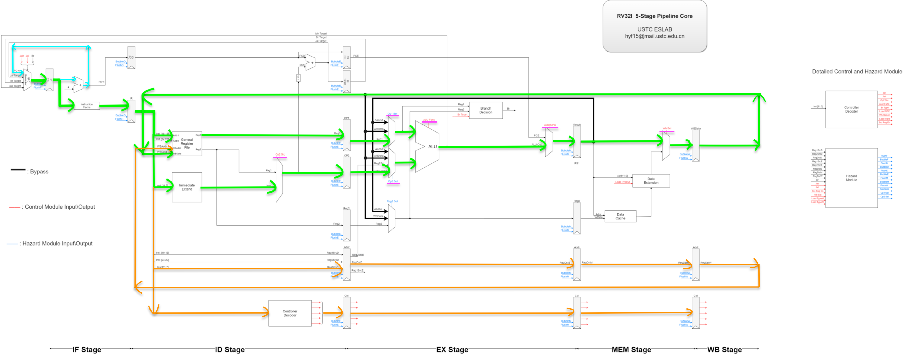
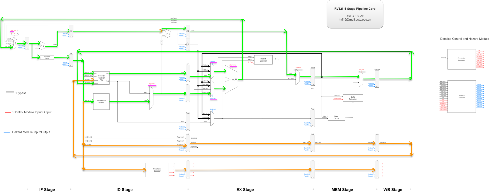
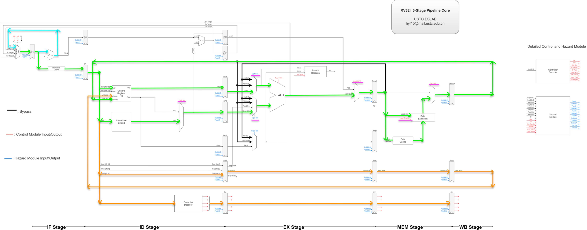
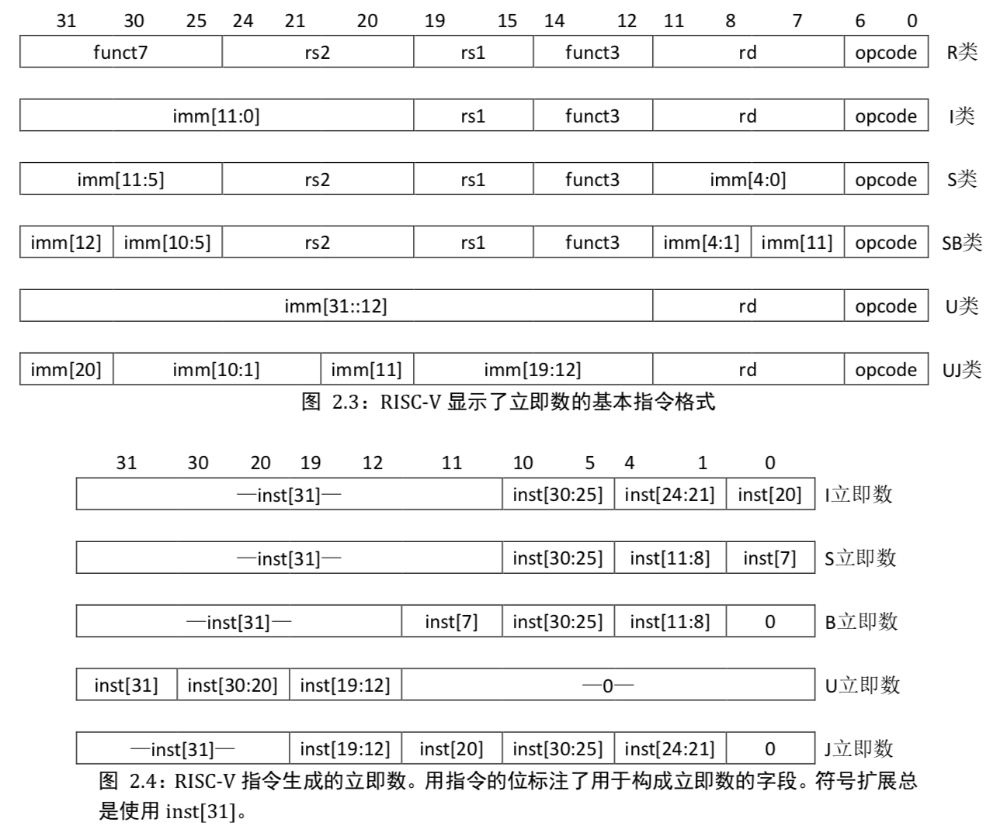

# RV32I指令集流水线CPU设计报告
<center> 陈炳楠 PB17111650</center>

---
## 待完成模块设计思路
---

### `NPC Generator`
`NextPC`值生成模块，根据三种跳转指令的跳转目标和是否确定跳转的信号，决定最后跳转的目标(`New PC`)的产生。这个单元存在的原因是`Jal`指令可能和 `Branch` 或 `Jalr` 同时确定跳转，这个时候就需要判断按照哪个目标跳转并冲刷流水段。

---

### `General Register file`
上升沿写入，异步读的寄存器堆。0号寄存器值始终为`32'b0`

---

### `Immediate Extend`
立即数扩展单元，根据`ImmType`(参见`Controller Decoder`)信号指定的立即数编码类型将操作码以外的25位立即数拓展为32为`Imm`参与运算

---

### `Data Extension`
非对齐`load`指令处理单元，对从`Data Cache`读取的四个字节中由`Load TypeM`指定的字节按照`Wb Sel`指定的寄存器写入`WBData`

---

### `Controller Decoder`
控制模块(译码器)，根据指令的操作码部分`opcode`, `funct3`和`funct7`产生如下控制信号:
* `Jal`: 标志`Jal`指令到达指令译码阶段
* `Jalr`: 标志`Jalr`指令到达执行阶段，即`Jal Target`已经通过`ALU`算数逻辑单元计算得出，并通过旁路引入。
* `Op2 Src`: 在`Reg2`和`Imm`选择值
* `ALU Func`: 算数逻辑运算种类(参见`ALU`部分)
* `Br Type`: 分枝类型(参见`Branch Decision`部分)
* `Load NPC`: 标志将`NextPC`输出到`Result`
* `Wb Select`: 选择写回的数据
* `Load TypeM`: 在访存阶段选择`Load`的数据类型来做出相应的数据拓展
* `Load TypeW`: 在写回阶段选择`Load`的数据模型来做出相应的写回操作
* `Src Reg En[1:0]`: 指令译码阶段的寄存器写入模式，说明两个源寄存器的使用情况。`Src Reg En[1:0] = 2'b00`，表示`rs1`，`rs2`两个寄存器都无效；`Src Reg En[1:0] = 2'b01`表示只有`rs1`寄存器有效；`Src Reg En[1:0] = 2'b10`表示只有`rs2`寄存器有效(好像没有这种情况)；`Src Reg En[1:0] = 2'b11`表示`rs1`和`rs2`寄存器都有效
```verilog
//SrcRegEn[2:0] six kind of ways to save values to Registers
    `define NOREGWRITE  3'd0    //Do not write Register
    `define LB          3'd1    //Load 8 bits from Mem then signed extend to 32 bits
    `define LH          3'd2    //Load 16 bits from Mem then signed extend to 32 bits
    `define LW          3'd3    //write 32 bits to Reg
    `define LBU         3'd4    //Load 8 bits from Mem then unsigned extend to 32 bits
    `define LHU         3'd5    //Load 16 bits from Mem then unsigned extend to 32 bits
```

* `ImmType`: 立即数编码类型
```verilog
//ImmType[2:0]
    `define RTYPE   3'd0
    `define ITYPE   3'd1
    `define STYPE   3'd2
    `define BTYPE   3'd3
    `define UTYPE   3'd4$$
    `define JTYPE   3'd5
```

---

### `ALU`
算数逻辑单元，接受`operand1`和`operand2`两个操作数，按照控制信号`ALU Func`执行对应的算数逻辑运算，将结果从`AlU Out`输出。各种算数逻辑运算对应控制信号如下: 
```verilog
//ALUFunc[4:0]
    `define SSLI    5'd0    //立即数逻辑左移(0)
    `define SRLI    5'd1    //立即数逻辑右移(0)
    `define SRAI    5'd2    //立即数算数右移(1)
    `define ADD     5'd3    //加法
    `define SUB     5'd4    //减法
    `define SLL     5'd5    //逻辑左移
    `define SRL     5'd6    //逻辑右移
    `define SRA     5'd7    //算数右移
    `define SLT     5'd8    //符号数比较
    `define SLTU    5'd9    //无符号数比较
    `define XOR     5'd10   //异或
    `define OR      5'd11   //或
    `define AND     5'd12   //与
    `define ADDI    5'd13   //立即数加法
    `define SLTI    5'd14   //有符号数比较
    `define SLTIU   5'd15   //无符号数比较
    `define XORI    5'd16   //立即数异或
    `define ORI     5'd17   //立即数或
    `define ANDI    5'd18   //立即数与
    `define LUI     5'd19   //立即数加载
    `define AUIPC   5'd20   //PC相对地址计算指令
```

---

### `Branch Decision`
跳转判断单元，根据控制信号`Br Type`指定的分支类型，对操作数`Reg1`和`Reg2`进行比较并判断是否跳转，将判断结果通过`Br`输出。各分支类型对应的控制信号如下: 
```verilog
//BrType[2:0]
    `define NOBRANCH    3'd0    //不跳转
    `define BEQ         3'd1    //等于跳转
    `define BNE         3'd2    //不等跳转
    `define BLT         3'd3    //小于跳转
    `define BLTU        3'd4    //无符号小于跳转
    `define BGE         3'd5    //大于跳转
    `define BGEU        3'd6    //无符号大于跳转
```

---

### `Hazard Module`
流水线冲突处理模块，基本手段: 
1. 插入气泡`BubbleF`, `BubbleD`, `BubbleE`, `BubbleM`, `BubbleW`
2. 定向路径(旁路)`Bypass` 
3. 冲刷流水段`FlushF`, `FlushD`, `FlushE`, `FlushM`, `FlushW`
* `Reg[1-2]?[Dst,Src][D,E,M,W]`: 要写回的寄存器在不同阶段值的保存
* `Br`: 在执行阶段产生条件跳转指令的判断结果
* `Flush[F,D,E,M,W]?`, `Bubble[F,D,E,M,W]?`: 气泡和冲刷控制
* `Op1 Sel`, `Op2 Sel`: `ALU`单元数据来源选择(包括旁路)
  
---

### `RV32Core`
RV32I 指令集CPU的顶层模块

---

## 报告内容

---

#### 1.描述执行一条`ADDI`指令的过程(数据通路、控制信号等)


* `IF`: PC自动加4, 取出指令。
* `ID`: 从寄存器中选出操作数1，立即数生成操作数2。
* `EX`: 通过`Op1 sel`和`Op2 sel`选择`ALU`的两个操作数来源为`Reg1`和`Reg2OrImm`，通过`ALU Func`选择加法，之后信号`Load NPC = 0`表明计算的不是下一条指令的地址。
* `MEM`: 信号`Wb Sel`选择`Result`计算出的结果。
* `WB`: 使用一直传下去`RegDst`信号(写回地址)将`WBDate`内的数据写回寄存器。


#### 2.描述执行一条`JALR`指令的过程·(数据通路、控制信号等)


* `IF`: PC自动加4, 取出指令
* `ID`: 从寄存器中选出操作数1，立即数生成操作数2通过信号`Op2 Src`，`PC+4`继续传递。
* `EX`: 通过`Op1 sel`和`Op2 sel`选择`ALU`的两个操作数来源来源为`Reg1`和`Reg2OrImm`，通过`ALU Func`选择加法，之后信号`Load NPC = 1`表明计算的是下一条指令的地址(真实的`NPC`已经传入`NPC Generator`)，之后将`PC+4`传入寄存器`Result`。
* `MEM`: 通过信号`Wb Sel`选择`Result`内的数值。
* `WB`: 使用一直传下去`RegDst`信号(写回地址)将`WBDate`内的数据(即`PC+4`)写回寄存器。


#### 3.描述执行一条`LW`指令的过程(数据通路、控制信号等)


* `IF`: PC自动加4, 取出指令
* `ID`: 从寄存器中选出操作数1，立即数生成操作数2通过信号`Op2 Src`，`PC+4`继续传递。
* `EX`: 通过`Op1 sel`和`Op2 sel`选择`ALU`的两个操作数来源为`Reg1`和`Reg2OrImm`，通过`ALU Func`选择加法，之后信号`Load NPC = 0`表明计算的不是下一条指令的地址，之后将计算好的要取数据的地址传入寄存器`Result`。
* `MEM`: 通过`Result`中的值在`Data Cache`选取数据，之后根据`Load TypeM`将取出的数据进行扩展，然后根据信号`Wb Sel`选择从`Data Cache`选取出的数据传入寄存器`WBData`。
* `WB`: 使用一直传下去`RegDst`信号(写回地址)将`WBDate`内的数据写回寄存器。


#### 4.如果要实现`CSR`指令(`csrrw`，`csrrs`，`csrrc`，`csrrwi`，`csrrsi`，`csrrci`)，设计图中还需要增加什么部件和数据通路?给出详细说明
`CSR`是指原子性读-修改-写控制和状态寄存器的一系列指令。首先分别解释一下这些指令。
> `CSRRW: `指令原子性的交换`CSR`和整数寄存器中的值。指令读取在`CSR`中的旧值，将其零扩展到 XLEN 位，然后写入整数寄存器 `rd`中。`rs1`寄存器 中的值将被写入`CSR`中

>`CSRRS: `指令读取`CSR`的值，将其零扩展到`XLEN`位，然 后写入整数寄存器`rd`中。整数寄存器`rs1`中的初始值被当做按位掩码指明了哪些`CSR`中的位被置为`1`

>`CSRRC: `指令读取`CSR`的值，将其零扩展到`XLEN`位，然 后写入整数寄存器`rd`中。整数寄存器`rs1`中的初始值被当做按位掩码指明了哪些`CSR`中的位被置为`0`

>`CSRRWI、CSRRSI、CSRRCI: `分别与`CSRRW`指令、`CSRRS`指令、`CSRRC`指令相似，除了它们是使用一个处于`rs1`字段的、零扩展到`XLEN`位的`5`位立即数(`zimm[4:0]`) 而不是使用`rs1`整数寄存器的值

下面详细说明需要加的部件和数据通路:
>寄存器堆(CSR)：CSR是新的状态寄存器堆，需要用来存储处理器的状态和ALU运算结果的某些特征即控制指令的执行

>rd: CSR的值写回的rd寄存器

>零扩展部件：将CSR的值进行零扩展

>选择器：并且CSR指令的源操作数也有寄存器和立即数之分，需要根据操作码进行选择。

>段寄存器：需要将不同状态寄存器值传递到下一个周期，并且要把不同的处理结果写回，所以需要保存写回的目标地址

>数据总线：在指令执行过程中，不同阶段的值的传递需要通过数据总线，具体来说，需要将CSR作为一种选择引入到`ALU`的输入中
#### 5.哪些指令分别采用了五类立即数(`I-type`，`S-type`，`B-type`，`U-type`，`J-type`至少各举一例)?`Verilog`如何将这些立即数拓展成`32`位的?
>`I-type: `ADDI, SLTI[U], ANDI, ORI, XORI, JALR, LW, LH, LHU。

>`S-type: `SW, SH, SB。

>`B-type: `BEQ, BNE, BLT[U], BGE[U]

>`U-type: `LUI, AUIPC

>`J-type: `JAL

采用的立即数拓展方式如下图：


#### 6.如何实现`Data Cache`的非字对齐的`Load`和`Store`?
* `Load`: 由于是非对齐数据，所以需要分两个时钟周期读取(每个周期读取32位)，之后根据需要的部分进行截取
* `Store`: 首先将非对齐数据进行拓展至64位，然后分两个时钟周期进行存储

#### 7.`ALU`模块中，默认`wire`变量是有符号数还是无符号数?
我觉得默认是无符号数，关键在于对于最高位的处理和对数据溢出的处理，默认无符号数会便于数据的处理

#### 8.哪条指令执行过程中会使得`Load Npc == 1`?
只有无条件跳转指令`Jal`和`Jalr`才会使得`Load Npc == 1`
#### 9.`NPC Generator`中对于不同跳转`target`的选择有没有优先级?
有，因为`Jal`指令目标地址生成于`ID`段，`Branch`类的指令和`Jalr`指令生成于`EX`段。这时`EX`在前有较高的优先级，会按照`EX`段的结果跳转并冲刷掉后面的`ID`段。所以`Branch`类的指令和`Jalr`指令会有更高的优先级。

#### 10.`Harzard`模块中，有哪几类冲突需要插入气泡?
* `Load`指令后面跟着使用`Rd`的指令
* `Load`指令后面跟着分支条件与`Rd`相关的跳转指令或与`Rd`相关的无条件跳转指令
* 分支跳转条件在测试成功之后或指令为无条件跳转指令(可以只是用`flush`信号，不需要`bubble`)

#### 11.`Harzard`模块中采用默认不跳转的策略，遇到`branch`指令时，如何控制`flush`和`stall`信号?
`Branch Decision`模块根据输入当确定跳转时，产生`Br`信号。此时，`Hazard Module`接受到信号，产生`FlushF`,`FlushD`信号，不产生`Bubble`相关的信号。

#### 12.`0`号寄存器值始终为`0`，是否会对`forward`的处理产生影响
会产生影响，需要进行特殊处理。如果是数据相关，当冲突发生在0号寄存器上，就忽略该冲突，因为不可能对0号寄存器写。所以在实际的`froward`中我们会增加额外的检测条件，只有当其它条件成立且`Rd`不为`0`的情况下才会进行转发。


