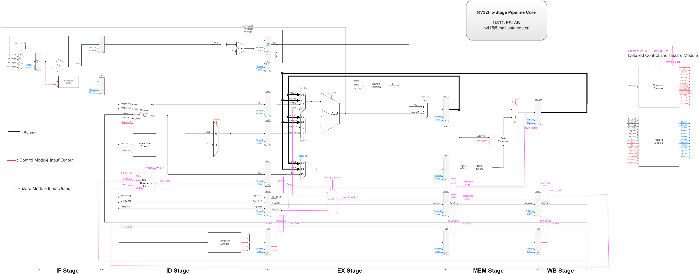

<center><font color=#6495ED>RISCV Lab2 Report</font></center>
===
---
> 实验目标：使用`verilog HDL`实现RISC_V_32I流水线CPU
>
>实验环境和工具：
>
>操作系统：Windows 10 (64-bits)
>综合工具：Vivado 2019
>姓名：陈炳楠
>学号：PB17111650
---

## <font color=#6495ED>1.第一阶段实验内容和过程</font>
### <font color=#6495ED>核心代码设计</font>
#### (1) `NPC_Generator`
设计思路：
> 1.根据信号确定跳转mubiao
> 2.不同的信号有不同的优先级，所以需要注意优先级高的放在条件判断的前几条

具体设计：
```verilog
module NPC_Generator(
    input wire [31:0] PC, jal_target, jalr_target, br_target,
    input wire jal, jalr, br,
    output reg [31:0] NPC
    );

    // TODO: Complete this module
    always@(*)
        begin
            if(jalr) NPC <= jalr_target;//间接跳转指令
            else if(br) NPC <= br_target;//条件跳转指令
            else if(jal) NPC <= jal_target;//直接跳转指令
            else NPC <= PC;
        end
endmodule

```
---

#### (2) `ImmExtend`

设计思路：
> 1.解析输入的指令，确认立即数拓展类型，之后生成立即数
> 2.其中需要参考`Parameters.v`文件内的不同立即数类型宏定义来选取不同的位数做不同立即数拓展

```verilog
`include "Parameters.v"   
module ImmExtend(
    input wire [31:7] inst,
    input wire [2:0] imm_type,
    output reg [31:0] imm
    );

    always@(*)
    begin
        case(imm_type)
            `ITYPE: imm <= {{21{inst[31]}}, inst[30:20]};
            `RTYPE: imm <= 32'b0;
            `STYPE: imm <= {{21{inst[31]}}, inst[30:25], inst[11:7]};
            `BTYPE: imm <= {{20{inst[31]}}, inst[7], inst[30:25], inst[11:8], 1'b0};
            `UTYPE: imm <= {inst[31:12], 12'b0};
            `JTYPE: imm <= {{12{inst[31]}}, inst[19:12], inst[20], inst[30:21], 1'b0};
            default: imm <= 32'hxxxxxxxx;
            // TODO: complete left part
            // Parameters.v defines all immediate type
        endcase
    end
    
endmodule
```

---

#### (3) `ControllerDecoder`
设计思路：
>1.为了方便理解，采用`localparam`和重新定义名字的方法，根据输入的指令确定输出信号的值
>2.需要合理利用`Parameter.v`文件内的宏定义
>3.对于每一种指令，采取Opcode、Fn3和Fn7来确定它的类型


```verilog
`include "Parameters.v"   
module ControllerDecoder(
    input wire [31:0] inst,
    output wire jal,
    output wire jalr,
    output wire op2_src,
    output reg [3:0] ALU_func,
    output reg [2:0] br_type,
    output wire load_npc,
    output wire wb_select,
    output reg [2:0] load_type,
    output reg [1:0] src_reg_en,
    output reg reg_write_en,
    output reg [3:0] cache_write_en,
    output wire alu_src1,
    output wire [1:0] alu_src2,
    output reg [2:0] imm_type
    );
    //======================================================================
    //指令分块
    //基本思路：Op + Fn3 + Fn7 确定�?条指�?
    wire [6:0] Op, Fn7;
    wire [2:0] Fn3;
    wire [4:0] Rs2, Rs1, RD;
    assign {Fn7, Rs2, Rs1, Fn3, RD, Op} = inst;
    // TODO: Complete this module
    localparam ALUR_OP = 7'b011_0011;//ADD、SUB、SLL、SRL、SRA、SLT、SLTU、XOR、OR、AND
    localparam ALUI_OP = 7'b001_0011;//SSLI、SRLI、SRAI、ADDI、SLTI、SLTIU、XORI、ORI、ANDI
    localparam LUI_OP = 7'b011_0111;//LUI
    localparam AUIPC_OP = 7'b001_0111;//AUIPC
    localparam JALR_OP = 7'b110_0111;//JALR
    localparam JAL_OP = 7'b110_1111;//JAL
    localparam BR_OP = 7'b110_0011;//BEQ、BNE、BLT、BGE、BLTU、BGEU
    localparam LOAD_OP = 7'b000_0011;//LB、LH、LW、LBU、LHU
    localparam STORE_OP = 7'b010_0011;//SB、SH、SW
    //======================================================================
    //具体信号
    //移位指令
    wire SLLI, SRLI, SRAI, SLL;
    assign SLLI = (Op == ALUI_OP) && (Fn3 == 3'b001) && (Fn7 == 7'b000_0000);
    assign SRLI = (Op == ALUI_OP) && (Fn3 == 3'b101) && (Fn7 == 7'b000_0000);
    assign SRAI = (Op == ALUI_OP) && (Fn3 == 3'b101) && (Fn7 == 7'b010_0000);
    assign SLL = (Op == ALUR_OP) && (Fn3 == 3'b001) && (Fn7 == 7'b000_0000);
    assign SRL = (Op == ALUR_OP) && (Fn3 == 3'b101) && (Fn7 == 7'b000_0000);
    assign SRA = (Op == ALUR_OP) && (Fn3 == 3'b101) && (Fn7 == 7'b010_0000);
    //计算指令
    wire ADD, SUB, ADDI;
    assign ADD = (Op == ALUR_OP) && (Fn3 == 3'b000) && (Fn7 == 7'b000_0000);
    assign SUB = (Op == ALUR_OP) && (Fn3 == 3'b000) && (Fn7 == 7'b010_0000);
    assign ADDI = (Op == ALUI_OP) && (Fn3 == 3'b000);
    //比较指令
    wire SLT, SLTU, SLTI, SLTIU;
    assign SLT = (Op == ALUR_OP) && (Fn3 == 3'b010) && (Fn7 == 7'b000_0000);
    assign SLTU = (Op == ALUR_OP) && (Fn3 == 3'b011) && (Fn7 == 7'b000_0000);
    assign SLTI = (Op == ALUI_OP) && (Fn3 == 3'b010);
    assign SLTIU = (Op == ALUI_OP) && (Fn3 == 3'b011);
    //逻辑指令
    wire XOR, OR, AND, XORI, ORI, ANDI;
    assign XOR = (Op == ALUR_OP) && (Fn3 == 3'b100) && (Fn7 == 7'b000_0000);
    assign OR = (Op == ALUR_OP) && (Fn3 == 3'b110) && (Fn7 == 7'b000_0000);
    assign AND = (Op == ALUR_OP) && (Fn3 == 3'b111) && (Fn7 == 7'b000_0000);
    assign XORI = (Op == ALUI_OP) && (Fn3 == 3'b100);
    assign ORI = (Op == ALUI_OP) && (Fn3 == 3'b110);
    assign ANDI = (Op == ALUI_OP) && (Fn3 == 3'b111);
    //立即数指�?
    wire LUI, AUIPC;
    assign LUI = (Op == LUI_OP);
    assign AUIPC = (Op == AUIPC_OP);
    
    wire JALR, JAL, BEQ, BNE, BLT, BGE, BLTU, BGEU;
    assign JALR = (Op == JALR_OP);
    assign JAL = (Op == JAL_OP);
    assign BEQ = (Op == BR_OP) && (Fn3 == 3'b000);
    assign BNE = (Op == BR_OP) && (Fn3 == 3'b001);
    assign BLT = (Op == BR_OP) && (Fn3 == 3'b100);
    assign BGE = (Op == BR_OP) && (Fn3 == 3'b101);
    assign BLTU = (Op == BR_OP) && (Fn3 == 3'b110);
    assign BGEU = (Op == BR_OP) && (Fn3 == 3'b111);
    //Load指令
    wire LB, LH, LW, LBU, LHU;
    assign LB = (Op == LOAD_OP) && (Fn3 == 3'b000);
    assign LH = (Op == LOAD_OP) && (Fn3 == 3'b001);
    assign LW = (Op == LOAD_OP) && (Fn3 == 3'b010);
    assign LBU = (Op == LOAD_OP) && (Fn3 == 3'b100);
    assign LHU = (Op == LOAD_OP) && (Fn3 == 3'b101);
    //Store指令
    wire SB, SH, SW;
    assign SB = (Op == STORE_OP) && (Fn3 == 3'b000);
    assign SH = (Op == STORE_OP) && (Fn3 == 3'b001);
    assign SW = (Op == STORE_OP) && (Fn3 == 3'b010);

    //===============================================================================================
    // 各输出信号处?
    //------------------- jal -------------------------
    assign jal = JAL;
    //------------------- jalr -------------------------
    assign jalr = JALR;
    //------------------- op2_src ----------------------
    assign op2_src = SLLI || SRLI || SRAI || ADDI || SLTI || SLTIU || XORI || ORI || ANDI || LUI || AUIPC || JALR || JAL || BEQ || BNE || BLT || BGE || BLTU || BGEU || LB || LH || LW || LBU || LHU || SB || SH || SW;
    //------------------- ALU_func -------------------------
    always @ (*)
        begin
            if (SLL || SLLI)        ALU_func <= `SLL;
            else if (SRL || SRLI)   ALU_func <= `SRL;
            else if (SRA || SRAI)   ALU_func <= `SRA;
            else if (ADD || ADDI || AUIPC || JALR || Op == LOAD_OP || Op == STORE_OP)   
                                    ALU_func <= `ADD;
            else if (SUB)           ALU_func <= `SUB;
            else if (XOR || XORI)   ALU_func <= `XOR;
            else if (OR || ORI)     ALU_func <= `OR;
            else if (AND || ANDI)   ALU_func <= `AND;
            else if (SLT || SLTI)   ALU_func <= `SLT;
            else if (SLTU || SLTIU) ALU_func <= `SLTU;
            else if (LUI)           ALU_func <= `LUI;
            else                    ALU_func <= 4'b1111;
        end
    //-------------------br_type-------------------------
    always @ (*)
        begin
            if (BEQ)        br_type <= `BEQ;
            else if (BNE)   br_type <= `BNE;
            else if (BLT)   br_type <= `BLT;
            else if (BLTU)  br_type <= `BLTU;
            else if (BGE)   br_type <= `BGE;
            else if (BGEU)  br_type <= `BGEU;
            else            br_type <= `NOBRANCH;  
        end
    //------------------- load_npc -------------------------
    assign load_npc = JAL || JALR;
    //------------------- wb_select -------------------------
    wire RegWD_NL = LUI || AUIPC || (Op == ALUR_OP) || (Op == ALUI_OP) || JAL || JALR;
    wire RegWD_L = LB || LH || LW || LBU || LHU;
    assign wb_select = RegWD_NL ? 1'b0 : (RegWD_L ? 1'b1 : 1'b0);
    //------------------- load_type -------------------------
    always @ (*)
        begin
            if (LB)         load_type <= `LB;
            else if (LH)    load_type <= `LH;
            else if (LW)    load_type <= `LW;
            else if (LBU)   load_type <= `LBU;
            else if (LHU)   load_type <= `LHU;
            else            load_type <= `NOREGWRITE;
        end
    //------------------- src_reg_en -------------------------
    always @ (*)
        begin
            src_reg_en[0] <= (Op == ALUR_OP) || (Op == BR_OP) || (Op == STORE_OP);
            src_reg_en[1] <= (Op == ALUI_OP) || (Op == ALUR_OP) || (Op == LOAD_OP) || (Op == STORE_OP) || (Op == BR_OP) || JALR;
        end
    //------------------- reg_write_en -------------------------
    always @ (*)
        begin 
            if(RegWD_NL || RegWD_L) reg_write_en <= 1'b1;
            else reg_write_en <= 1'b0; 
        end
    //------------------- cache_write_en -------------------------
    always @ (*)
        begin
            if (SB)         cache_write_en <= 4'b0001;
            else if (SH)    cache_write_en <= 4'b0011;
            else if (SW)    cache_write_en <= 4'b1111;
            else            cache_write_en <= 4'b0000;
        end
    //------------------- imm_type -------------------------
    always @ (*)
        begin
            if (Op == ALUR_OP)          imm_type <= `RTYPE;
            else if (Op == ALUI_OP || Op == LOAD_OP || JALR)   imm_type <= `ITYPE;
            else if (LUI || AUIPC)      imm_type <= `UTYPE;
            else if (JAL)               imm_type <= `JTYPE;
            else if (Op == BR_OP)       imm_type <= `BTYPE;
            else if (Op == STORE_OP)    imm_type <= `STYPE;
            else                        imm_type <= 3'b111;
        end
    //------------------- alu_src1 -------------------------
    assign alu_src1 = AUIPC;
    //------------------- alu_src2 -------------------------
    assign alu_src2 = (SLLI || SRLI || SRAI) ? 2'b01 : ((Op == ALUR_OP || Op == BR_OP) ? 2'b00 : 2'b10);
endmodule
```
---

#### (4) `ALU`
设计思路：
>1.根据信号`ALU_func`以及宏定义规定运算器的操作
>2.对于有、无符号的运算使用`$signed(x)`和`$unsigned(x)`来做转化

```verilog
`include "Parameters.v"   
module ALU(
    input wire [31:0] op1,
    input wire [31:0] op2,
    input wire [3:0] ALU_func,
    output reg [31:0] ALU_out
    );

    // TODO: Complete this module
    always @ (*)
        begin
            case (ALU_func)
                `SLL:   ALU_out <= op1 << op2[4:0];
                `SRL:   ALU_out <= op1 >> op2[4:0];
                `SRA:   ALU_out <= $signed(op1) >>> op2[4:0];
                `ADD:   ALU_out <= op1 + op2;
                `SUB:   ALU_out <= op1 - op2;
                `XOR:   ALU_out <= op1 ^ op2;
                `OR:    ALU_out <= op1 | op2;
                `AND:   ALU_out <= op1 & op2;
                `SLT:   ALU_out <= $signed(op1) < $signed(op2) ? 32'd1 : 32'd0;
                `SLTU:  ALU_out <= $unsigned(op1) < $unsigned(op2) ? 32'd1 : 32'd0;
                `LUI:   ALU_out <= {op2[31:12], 12'd0};
                default:    ALU_out <= 32'd0;
            endcase
        end
endmodule
```
#### (5) `BranchDecision`
设计思路：
>1.通过Branch指令类型来判断输出信号`br`的值
>2.参考`Parameter.v`内的宏定义
```verilog
`include "Parameters.v"   
module BranchDecision(
    input wire [31:0] reg1, reg2,
    input wire [2:0] br_type,
    output reg br
    );

    // TODO: Complete this module
    always @ (*)
        begin
            case(br_type)
                `NOBRANCH:  br <= 1'b0;
                `BEQ:       br <= (reg1 == reg2);
                `BNE:       br <= (reg1 != reg2);
                `BLT:       br <= ($signed(reg1) < $signed(reg2));
                `BLTU:      br <= ($unsigned(reg1) < $unsigned(reg2));
                `BGE:       br <= ($signed(reg1) >= $signed(reg2));
                `BGEU:      br <= ($unsigned(reg1) >= $unsigned(reg2));
                default:    br <= 1'b0;
            endcase
        end
endmodule
```

---

#### (6) `DataExtend`
设计思路：
>1.需要根据Load指令装载数据的位数选择不同的位数拓展
>2.需要根据信号`addr`作为32位数据的偏移量，选择不同区域的数据

```verilog
`include "Parameters.v"

module DataExtend(
    input wire [31:0] data,
    input wire [1:0] addr,
    input wire [2:0] load_type,
    output reg [31:0] dealt_data
    );

    // TODO: Complete this module
    always @ (*)
        begin
            case (load_type)
                `NOREGWRITE:    dealt_data <= 32'b0;
                `LB:    
                    begin
                        case(addr)
                            2'b00:  dealt_data <= {{24{data[7]}}, data[7:0]};
                            2'b01:  dealt_data <= {{24{data[15]}}, data[15:8]};
                            2'b10:  dealt_data <= {{24{data[23]}}, data[23:16]};
                            2'b11:  dealt_data <= {{24{data[31]}}, data[31:24]};
                            default:    dealt_data <= 32'bx;
                        endcase
                    end
                `LH:
                    begin
                        casex(addr)
                            2'b00:  dealt_data <= {{16{data[15]}}, data[15:0]};
                            2'b01:  dealt_data <= {{16{data[23]}}, data[23:8]};
                            2'b10:  dealt_data <= {{16{data[31]}}, data[31:16]};
                            default:    dealt_data <= 32'bx;
                        endcase
                    end
                `LW:    dealt_data <= data;
                `LBU:   
                    begin
                        case(addr)
                            2'b00:  dealt_data <= {24'b0, data[7:0]};
                            2'b01:  dealt_data <= {24'b0, data[15:8]};
                            2'b10:  dealt_data <= {24'b0, data[23:16]};
                            2'b11:  dealt_data <= {24'b0, data[31:24]};
                            default: dealt_data <= 32'bx;
                        endcase
                    end
                `LHU:
                    begin
                        casex(addr)
                            2'b00:  dealt_data <= {16'b0, data[15:0]};
                            2'b01:  dealt_data <= {16'b0, data[23:8]};
                            2'b10:  dealt_data <= {16'b0, data[31:16]};
                            default:    dealt_data <= 32'bx;
                        endcase
                    end
                default:    dealt_data <= 32'bx;
            endcase
        end
endmodule
```
---

### <font color=#6495ED>测试样例及实现结果</font>
#### (1)设计的测试样例

```
test-move2.om:     file format elf32-littleriscv

Disassembly of section .text:

00010080 <_start>:
   10080:	00000013          	nop
   10084:	00700093          	li	ra,7
   10088:	fff00b93          	li	s7,-1
   1008c:	00200c13          	li	s8,2

00010090 <test_1>:
   10090:	001b9113          	slli	sp,s7,0x1

00010094 <test_2>:
   10094:	001bd193          	srli	gp,s7,0x1

00010098 <test_3>:
   10098:	401bd213          	srai	tp,s7,0x1

0001009c <test_4>:
   1009c:	002082b3          	add	t0,ra,sp

000100a0 <test_5>:
   100a0:	40308333          	sub	t1,ra,gp

000100a4 <test_6>:
   100a4:	018093b3          	sll	t2,ra,s8

000100a8 <test_7>:
   100a8:	0020a433          	slt	s0,ra,sp

000100ac <test_8>:
   100ac:	0020b4b3          	sltu	s1,ra,sp

000100b0 <test_9>:
   100b0:	0000c533          	xor	a0,ra,zero

000100b4 <test_10>:
   100b4:	018bd5b3          	srl	a1,s7,s8

000100b8 <test_11>:
   100b8:	418bd633          	sra	a2,s7,s8

000100bc <test_12>:
   100bc:	0020e6b3          	or	a3,ra,sp

000100c0 <test_13>:
   100c0:	0020f733          	and	a4,ra,sp

000100c4 <test_14>:
   100c4:	00108793          	addi	a5,ra,1

000100c8 <test_15>:
   100c8:	fff0a813          	slti	a6,ra,-1

000100cc <test_16>:
   100cc:	fff0b893          	sltiu	a7,ra,-1

000100d0 <test_17>:
   100d0:	0080c913          	xori	s2,ra,8

000100d4 <test_18>:
   100d4:	0100e993          	ori	s3,ra,16

000100d8 <test_19>:
   100d8:	0010fa13          	andi	s4,ra,1

000100dc <test_20>:
   100dc:	fffffab7          	lui	s5,0xfffff

000100e0 <test_21>:
   100e0:	00004b17          	auipc	s6,0x4
	...

```
---

#### (2)测试结果


通过测试样例的对比可以看出第一阶段各指令实现正确，最终寄存器的值符合要求，第一阶段实验成功。

---
## <font color=#6495ED>2.第二阶段实验内容和过程</font> 
### <font color=#6495ED>核心代码设计</font>
#### (1) `HazardUnit`
设计理念：
>1.将冲突主要分为两部分模块来设计处理。一部分是`flush`和`bubble`信号放在一起处理，第二部分是数据旁路的处理，由`op1_sel`、`op2_sel`和`reg2_sel`组成。
>2.其中`op1_sel`和`op2_sel`主要用来处理数据运算的两个源操作数；`reg2_sel`主要用来处理Branch类型指令和store类指令写回的数据。
>3.`flush`和`bubble`部分：
>(1)`rst`信号是用来做段间积存器的flush工作
>(2)当EX阶段信号`wb_select`值为1(说明这时EX阶段为Load指令)，并且EX段的写回寄存器号和ID段的源寄存器号一致时且目标寄存器不是0号寄存器时，说明此时出现RAW冲突，需要两条指令中间形成暂停，具体需要在IF和ID阶段生成`bubble`信号
>(3)当EX阶段为`br`或`jalr`指令时，需要在ID和EX阶段生成冲刷流水段的信号，用来取到正确的目标地址
>(4)当EX阶段为`jal`指令时，需要在ID阶段生成冲刷流水段的信号，用来取到正确的地址
>(5)除了上述情况外，不需要产生流水段的`flush`或`bubble`信号
>4.旁路部分：
>(1)`Op1_sel`,`Op2_sel`: -1.当MEM阶段写回的目标寄存器和EX阶段的源寄存器时一样的时候，需要使用旁路段间寄存器result将需要数据使用旁路转到EX阶段 -2.同理当WB阶段写回的目标寄存器和EX阶段的源寄存器时一样的时候，需要使用旁路段间寄存器WBData将需要数据使用旁路转到EX阶段 -3.其它情况下不需要转发，需要根据alu_src1和alu_src2来选择正确的源操作数
>(2)`reg2_sel`: 情况类似上述(1)
>(3)需要注意在生成`Op2_sel`时，需要额外的信号来判断是否在满足情况下需要使用旁路信号，因为只有在store指令时源操作数2才需要使用旁路，其它情况下只需要源操作数1使用旁路


```verilog
module HarzardUnit(
    input wire rst,
    input wire [4:0] reg1_srcD, reg2_srcD, reg1_srcE, reg2_srcE, reg_dstE, reg_dstM, reg_dstW,
    input wire br, jalr, jal,
    input wire [1:0] src_reg_en,
    input wire wb_select,
    input wire reg_write_en_EX,
    input wire reg_write_en_MEM,
    input wire reg_write_en_WB,
    input wire cache_write_en_EX,
    input wire alu_src1,
    input wire [1:0] alu_src2,
    output reg flushF, bubbleF, flushD, bubbleD, flushE, bubbleE, flushM, bubbleM, flushW, bubbleW,
    output reg [1:0] op1_sel, op2_sel, reg2_sel
    );
    
    // TODO: Complete this module
    always @ (*)
        begin
            if(rst)
                begin
                    flushF <= 1'b1; bubbleF <= 1'b0;
                    flushD <= 1'b1; bubbleD <= 1'b0;
                    flushE <= 1'b1; bubbleE <= 1'b0;
                    flushM <= 1'b1; bubbleM <= 1'b0;
                    flushW <= 1'b1; bubbleW <= 1'b0;
                end
            else if (wb_select && ((reg_dstE == reg1_srcD) || (reg_dstE == reg2_srcD) && reg_dstE != 5'b0 ))
                begin
                    flushF <= 1'b0; bubbleF <= 1'b1;
                    flushD <= 1'b0; bubbleD <= 1'b1;
                    flushE <= 1'b0; bubbleE <= 1'b0;
                    flushM <= 1'b0; bubbleM <= 1'b0;
                    flushW <= 1'b0; bubbleW <= 1'b0;
                end
            else if (br || jalr)
                begin
                    flushF <= 1'b0; bubbleF <= 1'b0;
                    flushD <= 1'b1; bubbleD <= 1'b0;
                    flushE <= 1'b1; bubbleE <= 1'b0;
                    flushM <= 1'b0; bubbleM <= 1'b0;
                    flushW <= 1'b0; bubbleW <= 1'b0;                    
                end
            else if (jal)
                begin
                    flushF <= 1'b0; bubbleF <= 1'b0;
                    flushD <= 1'b1; bubbleD <= 1'b0;
                    flushE <= 1'b0; bubbleE <= 1'b0;
                    flushM <= 1'b0; bubbleM <= 1'b0;
                    flushW <= 1'b0; bubbleW <= 1'b0;                    
                end
            else 
                begin
                    flushF <= 1'b0; bubbleF <= 1'b0;
                    flushD <= 1'b0; bubbleD <= 1'b0;
                    flushE <= 1'b0; bubbleE <= 1'b0;
                    flushM <= 1'b0; bubbleM <= 1'b0;
                    flushW <= 1'b0; bubbleW <= 1'b0;                    
                end
        end

//=======================================================================================================
//op1_sel
// src_reg_en        指令中src reg的地�?是否有效，src_reg_en[1] == 1表示reg1被使用到了，src_reg_en[0]==1表示reg2被使用到�?
    always @ (*)
        begin
            if ((src_reg_en[1] == 1'b1) && (reg_write_en_MEM) && (reg_dstM != 5'b0) && (reg1_srcE == reg_dstM))
                op1_sel <= 2'b00;
            else if ((src_reg_en[1] == 1'b1) && (reg_write_en_WB) && (reg_dstW != 5'b0) && (reg1_srcE == reg_dstW) )
                op1_sel <= 2'b01;
            else if (alu_src1 == 1'b0)
                op1_sel <= 2'b11;
            else if (alu_src1 == 1'b1)
                op1_sel <= 2'b10;
        end
//=======================================================================================================
//op2_sel
    always @ (*)
        begin
            if ((src_reg_en[0] == 1'b1) && (reg_write_en_MEM) && (reg_dstM != 5'b0) && (reg2_srcE == reg_dstM) && !cache_write_en_EX)
                op2_sel <= 2'b00;
            else if ((src_reg_en[0] == 1'b1) && (reg_write_en_WB) && (reg_dstW != 5'b0) && (reg2_srcE == reg_dstW) && !cache_write_en_EX)
                op2_sel <= 2'b01;
            else if (alu_src2 == 2'b00 || alu_src2 == 2'b10)
                op2_sel <= 2'b11;
            else if (alu_src2 == 2'b01)
                op2_sel <= 2'b10;
        end

//=======================================================================================================
//reg2_sel
    always @ (*)
        begin
            if ((src_reg_en[0] == 1'b1) && (reg_write_en_MEM) && (reg_dstM != 5'b0) && (reg2_srcE == reg_dstM))
                reg2_sel <= 2'b00;
            else if ((src_reg_en[0] == 1'b1) && (reg_write_en_WB) && (reg_dstW != 5'b0) && (reg2_srcE == reg_dstW))
                reg2_sel <= 2'b01;
            else 
                reg2_sel <= 2'b10;
        end
endmodule
```
---
### <font color=#6495ED>测试样例及实现结果</font>
#### test1


#### test2


#### test3


通过以上结果可以看出所有测试样例测试成功，最后3号积存器的值为1.

---

## <font color=#6495ED>3.第三实验内容和过程</font>
该阶段主要是`CSR`指令的实现以及新的CSR设计通路框架设计。
添加CSR设计通路后的代码框架如下：


### <font color=#6495ED>核心代码设计</font>
#### (1)`csrALu`
>该阶段仿照`ALU`部分根据不同的CSR指令作出不同的操作
```verilog
`include "Parameters.v"   
module csrALU(
    input wire [31:0] op1,
    input wire [31:0] op2,
    input wire [4:0] op3,
    input wire [2:0] csrALU_func,
    output reg [31:0] ALU_out
    );
    //wire [31:0] op3_extend;
    //assign op3_extend = {27'd0, op3};
    // TODO: Complete this module
    always @ (*)
        begin
            case (csrALU_func)
                `CSRRW:     ALU_out <= op1 ;
                `CSRRS:     ALU_out <= op1 | op2;
                `CSRRC:     ALU_out <= (~op1) & op2;
                `CSRRWI:    ALU_out <= {27'd0, op3};
                `CSRRSI:    ALU_out <= op2 | {27'd0, op3};
                `CSRRCI:    ALU_out <= op2 & ~{27'd0, op3};
                default:    ALU_out <= 32'd0;
            endcase
        end
endmodule
```

#### (2)`CSRRegisterFile`
>该器件生成了4096个寄存器，实现同步下降沿写，异步读取的功能
```verilog
module CSRRegisterFile(
    input wire clk, 
    input wire rst, 
    input wire write_en, 
    input wire [11:0] addr, wb_addr, 
    input wire [31:0] wb_data, 
    output wire [31:0] csrreg
);

reg [31:0] csr_reg_file[4095:0];
integer i;

    // init register file
    initial
    begin
        for(i = 0; i < 4096; i = i + 1) 
            csr_reg_file[i][31:0] <= 32'b0;
    end

    // write in clk negedge, reset in rst posedge
    // if write register in clk posedge,
    // new wb data also write in clk posedge,
    // so old wb data will be written to register
    always@(negedge clk or posedge rst) 
    begin 
        if (rst)
            for (i = 0; i < 4096; i = i + 1) 
                csr_reg_file[i][31:0] <= 32'b0;
        else if(write_en)
            csr_reg_file[wb_addr] <= wb_data;   
    end

    // read data changes when address changes
    assign csrreg = csr_reg_file[addr];

endmodule
```
#### (3)段间寄存器
>为了实现CSR类指令，中间使用了很多新的寄存器，它们结构类似，都是将需要的数据传递给下一个周期，故只列出了一个CSR的段间寄存器
```verilog
module csrAddrid(
    input wire clk, bubbleE, flushE, 
    input wire [11:0] csrAid, 
    output reg [11:0] csrAex    
);

initial csrAex = 0;

always @ (posedge clk)
    if(!bubbleE)
    begin
        if(flushE)
            csrAex <= 0;
        else 
            csrAex <= csrAid;
    end

endmodule
```
#### (4)`Control Unit`新增的CSR相关信号
>为了使CSR指令成功做下去，需要在控制部分增加三种信号：
>(1)`csrreg_write_en`：在写CSR寄存器时使用，在WB阶段使用
>(2)`csrALU_func`：表示CSR指令的操作，计算正确的写回的数，在EX阶段使用
>(3)`csrwb_select`：在写回`General Register`时选择写回的数据是来自CSR指令生成的，在MEM阶段使用
>(4)这三种信号需要根据使用的时间在控制信号的段间进行传递
```verilog
    //------------------- csrreg_write_en -------------------------
    always @ (*)
        begin 
            if(CSRW || CSRS || CSRC || CSRWI || CSRCI || CSRSI ) csrreg_write_en <= 1'b1;
            else csrreg_write_en <= 1'b0; 
        end
    //------------------- csrALU_func ------------------------- 
    always @ (*)
        begin
            if (CSRW)       csrALU_func <= `CSRRW;
            else if (CSRS)  csrALU_func <= `CSRRS;
            else if (CSRC)  csrALU_func <= `CSRRC; 
            else if (CSRWI) csrALU_func <= `CSRRWI;
            else if (CSRSI) csrALU_func <= `CSRRSI;
            else if (CSRCI) csrALU_func <= `CSRRCI;
            else            csrALU_func <= 3'b111;
        end
    //------------------- csrwb_select -------------------------
    assign csrwb_select = (CSRW || CSRS || CSRC || CSRWI || CSRSI || CSRCI) ? 1'b1 : 1'b0;
```
### <font color=#6495ED>测试样例及实现结果</font>
#### (1)设计的测试样例
```s
# --------------------------------------------------------
# test part1
.section .text;
.align 6;
.global _start;

_start:

test_o:
li x1, 0x0011

li x2, 0x0012

li x3, 0x0013

li x4, 0x0014

li x5, 0x0015

li x6, 0x0016

li x7, 0x0001

test_1:
csrrw x8, 0x0a, x1 #csr-0x0a=0x11, x8=0

test_2:
csrrs x9, 0x0b, x2 #csr-0x0b=0x12, x9=0

test_3_1:
csrrs x10, 0x0c, x5 #csr-0x0c=0x15, x10=0

test_3_2:
csrrc x11, 0x0c, x3 #csr-0x0c=0x04, x11=0x15

test_4:
csrrwi x12, 0x0d, 0x1a #csr-0x0d=0x1a, x12=0

test_5:
csrrsi x13, 0x0e, 0x1b #csr-0x0e=0x1b, x13=0

test_6_1:
csrrsi x21, 0x0f, 0x1f # csr-0x0f=0x1f, x21=0

test_6_2:
csrrci x14, 0x0f, 0x1c #csr-0x0f=0x03, x14=0xff

test_7:
csrrw x15, 0x0a, x1 # csr-0x0a=0x11, x15=0x11

test_8:
csrrw x16, 0x0b, x1 # csr-0x0b=0x11, x16=0x12

test_9:
csrrw x17, 0x0c, x1 # csr-0x0c=0x11, x17=0x04

test_10:
csrrw x18, 0x0d, x1 # csr-0x0d=0x11, x18=0x1a

test_11:
csrrw x19, 0x0e, x1 # csr-0x0e=0x11, x19=0x1b

test_12:
csrrw x20, 0x0f, x1 # csr-0x0f=0x11, x20=0x03
```
#### (2)测试结果


通过测试样例的结果显示出第三阶段测试正确，最终寄存器的值符合要求，第三阶段实验成功。

---

## <font color=#6495ED>4.实验总结</font>
### 实验中踩过的坑
- 在`NPC_generator`部分没有通过`if else`语句成功体现出不同信号的优先级，所以在使用时出现了错误
- 在测试时一度出现高阻的信号，开始以为是assign信号在不符合情况下不会赋值为0，之后证明是有一个信号名字写错，assign使用是正确的。。。
- 在`Hazard`模块，对于`Op2_sel`开始处理时和`Op1_sel`写成了一样，后来发现除了部分情况外，只有第一个源操作数需要旁路转发的数据，而源操作数2是不需要这些数据的，所以需要添加额外的`cache_write_en_EX`信号来选择性的使用旁路数据。
- 在`csrwb_select`信号生成时，需要将它的控制部分添加到`WB_Data_WB`部分，之前这一部分不用自己实现，没有仔细学习。在添加之后发现生成的信号会和需要的时间错开一个周期，之后发现需要将它的旧值存储下来，在下一个周期赋值。

### 实验收获
- 深刻理解了基于5段流水的RISCV32 CPU的实现，对于每一个阶段所需要完成的工作有了较好的把握。对于流水线中解决数据冲突的旁路，冲刷流水线和暂停流水线技术以及各种指令间的冲突关系有了较好的理解。
- 对于自行设计CPU也有了简单的实践
- 对于RISCV的指令集体系结构也有了简单的认识
---

## <font color=#6495ED>5.实验改进意见</font>
- 要是对于不同的阶段能提供简单的测试样例，之后让我们根据简单的例子来设计较复杂的案例感觉会相对容易
- Hazard模块其实开始时是不太清楚的，要是能提供些帮助、学习资料什么的就更好了
- 模块挺清楚的，注释也很完备，层次感很强，感觉挺好上手的～