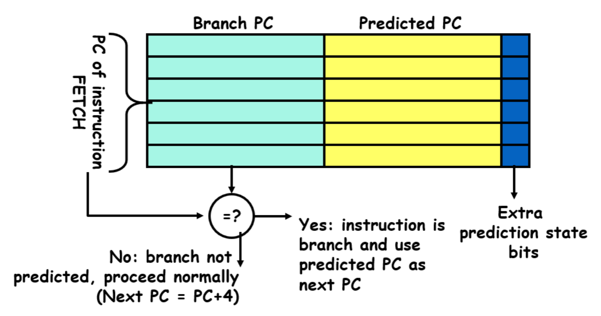
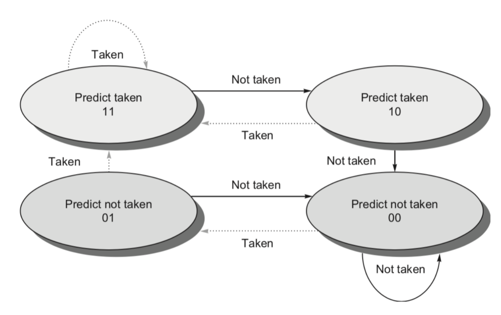
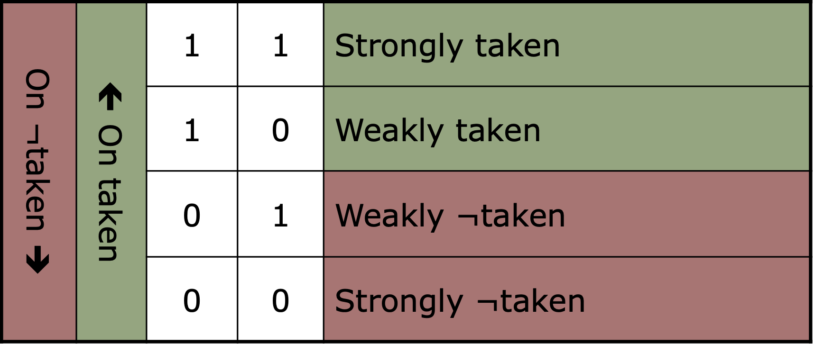
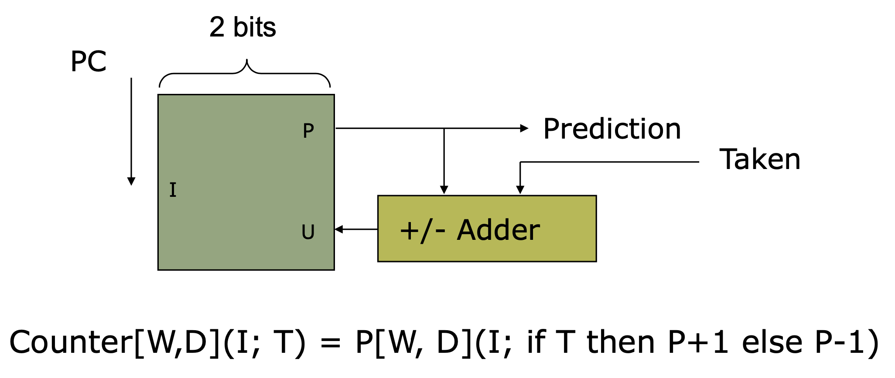

<center><font color=#6495ED>Lab4-分支预测实验报告</font></center>
===
---
> 实验目标：使用`systemverilog`实现分支预测部分的BTB和BHT设计
>
>实验环境和工具：
>
>操作系统：Windows 10 (64-bits)
>综合工具：Vivado 2017.2
>姓名：陈炳楠
>学号：PB17111650
---

## <font color=#6495ED>0.实验知识补充</font>
>BTB中缓存了先前执行过的分支语句的指令地址, 分支跳转地址以及分支预测的结果标识。取指指令机构工作时，同时检索一级指令缓存BTB，如果在BTB中找到相关目的指令地址与当前读取的指令相同，则按照BTB中记录的BTA地址读取下一条指令送入管线中，同时继续执行分支指令，分支指令执行完后若结果与预测不符合，那么将刷新BTB的有关记录，并进行分支预测错误的恢复操作。

>指令预取对列中的指令按照FIFO的方式依次进入指令译码器，当译码是发现是一条分支指令，则检查BTB中有无该种分支的记录。若有，则立即按照所记录的目标地址进行预取（目标地址对应的指令及其后面的指令），替代原先已进入指令预取队列中的指令。在这条指令执行完毕之前，将该指令的实际目标地址再添入BTB中，以使BTB中总保持最近遇到的分支指令及其目标地址。

---

## <font color=#6495ED>1.第一阶段实验内容和过程</font>
### <font color=#6495ED>BTB设计与说明</font>


- 主要设计参照如上图所示，其中`Branch PC`标记对应程序中的`BranchTagAddress`变量， `Predicted PC`对应存储的预测结果对应程序中的`BranchTargetAddress`变量。
- 当`IF`阶段产生的指令在`BTB`表中找到对应的一项并且最近一次跳转的标志位为真，则将预测结果有效变量改为`1`，将预测的`PC`值从`BTB`表中取出。
- 当`EX`阶段的操作码表示当前指令是`BR`类指令时。当`EX`阶段的`PC`值在`BTB`表中有存储时，更新`PC`值对应的预测`PC`值为`br_target`值，并将是否跳转的标示量更改为`br`对应的值；如果不存在对应的存储，则按照`FIFO`顺序进行`BTB`表的写入。

### <font color=#6495ED>BTB.sv</font>
```verilog
module btb # (
    parameter ENTRY_NYM = 64;//BTB大小
)(
    input clk, 
    input rst, 
    input [31:0] PC_IF, 
    input [31:0] PC_EX, 
    input [31:0] br_target, 
    input br, 
    input [6:0] Opcode_EX, 
    output reg [31:0] PredictPC, //PC预测结果
    output reg PredictF      //标志预测结果有效与否
);
//分支Opcode
localparam BR_OP = 7'b110_0011; 
//Buffer define
reg [31:0] BranchTagAddress[ENTRY_NYM - 1 : 0]; 
reg [31:0] BranchTargetAddress[ENTRY_NYM - 1 : 0]; 
reg Valid[ENTRY_NYM - 1 : 0]; 
//FIFO Index
reg [15 : 0] Index; 
//Produce PredictPC
always @ (*) begin
    if (rst) begin
        PredictPC <= 32'b0; 
        PredictF <= 1'b0; 
    end
    else begin
        PredictPC <= 32'b0; 
        PredictF <= 1'b0; 
        for (integer i = 0; i < ENTRY_NYM ; i++ ) begin
            if ((PC_IF == BranchTagAddress[i]) && Valid[i]) begin
                PredictF <= 1'b1; 
                PredictPC <= BranchTargetAddress[i]; 
            end
        end
    end
end 
//Renew Buffer
always @ (posedge clk or posedge rst) begin
    if (rst) begin
        for (integer i = 0; i < ENTRY_NYM ; i++ ) begin
            Valid[i] <= 1'b0; 
            BranchTagAddress[i] <= 32'd0; 
            BranchTargetAddress[i] <= 32'd0; 
        end
        Index <= 16'd0; 
    end
    else begin
        if (Opcode_EX == BR_OP) begin
            integer i; 
            for (i = 0; i < ENTRY_NYM; i++) begin
                if (PC_EX == BranchTagAddress[i]) begin
                    BranchTargetAddress[i] <= br_target; 
                    Valid[i] <= br; 
                    break; 
                end
            end
            if (i == ENTRY_NUM) begin
                BranchTargetAddress[Index] <= br_target; 
                Valid[Index] <= br; 
                BranchTagAddress[Index] <= PC_EX; 
                Index = Index + 1; 
            end
        end
    end
end
endmodule
```

### <font color=#6495ED>相关修改</font>
#### NPC_Generator.v
```verilog
module NPC_Generator(
    input wire [31:0] PC, jal_target, jalr_target, br_target,
    input wire jal, jalr, br,
    input [31:0] PC_EX, 
    input [31:0] PredictPC, 
    input PredictF, PredictE,
    output reg [31:0] NPC
    );
    // TODO: Complete this module
    always@(*)
        begin
            if(jalr) NPC <= jalr_target;//间接跳转指令
            else if (br & ~PredictE) NPC <= br_target; 
            else if (~br & PredictE) NPC <= PC_EX; 
            else if(jal) NPC <= jal_target;//直接跳转指令
            else if (PredictF) NPC <= PredictPC; 
            else NPC <= PC;
        end
endmodule
```
#### PC_ID.v
```verilog
module PC_ID(
    ...
    input wire PredictF, 
    output reg PredictD
    );

    initial begin ...PredictD = 0; end
    
    always@(posedge clk)
        if (!bubbleD) 
        begin
            if (flushD) begin
                ...
                PredictD <= 0; end
            else begin
                ...
                PredictD <= PredictF; end
        end
    
endmodule
```
#### CtrlEx.v
```verilog
module Ctrl_EX(
    ...
    input  wire [6:0] Opcode_ID, 
    output reg  [6:0] Opcode_EX, 
    input wire PredictD, 
    output reg PredictE
    );

    initial 
    begin
        ...
        Opcode_EX = 7'b0; 
        PredictE = 1'b0; 
    end
    
    always@(posedge clk)
        if (!bubbleE) 
        begin
            if (flushE)
            begin
                ...
                Opcode_EX <= 6'b0; 
                PredictE <= 1'b0; 
            end
            else
            begin
                ...
                Opcode_EX <= Opcode_ID; 
                PredictE <= PredictD; 
            end
        end
    
endmodule
```
#### HazardUnit.v
```verilog
module HarzardUnit(
    ...
    input wire PredictE
    );
    
    // TODO: Complete this module
    always @ (*)
        begin
            ...
            else 
            begin
                if (br & PredictE) begin
                    flushF <= 1'b0; bubbleF <= 1'b0;
                    flushD <= 1'b0; bubbleD <= 1'b0;
                    flushE <= 1'b0; bubbleE <= 1'b0;
                    flushM <= 1'b0; bubbleM <= 1'b0;
                    flushW <= 1'b0; bubbleW <= 1'b0;  
                end
                else if (~br & PredictE) begin
                    flushF <= 1'b0; bubbleF <= 1'b0;
                    flushD <= 1'b1; bubbleD <= 1'b0;
                    flushE <= 1'b1; bubbleE <= 1'b0;
                    flushM <= 1'b0; bubbleM <= 1'b0;
                    flushW <= 1'b0; bubbleW <= 1'b0; 
                end            
            ...
    end
        
endmodule
```
#### RV32ICore.v
```verilog
module RV32ICore(...)
    // ---------------------------------------------
    // Branch_Predict
    // ---------------------------------------------     
    wire [6:0] Opcode_EX; 
    wire PredictF, PredictD, PredictE; 
    wire [31:0] PredictPC;
    ...
    NPC_Generator NPC_Generator1(
        ...
        .PredictPC(PredictPC), 
        .PredictF(PredictF), 
        .PredictE(PredictE),
    );
    ...
    PC_ID PC_ID1(
        ...
        .PredictF(PredictF), 
        .PredictD(PredictD)
    );
    ...
    Ctrl_EX Ctrl_EX1(
        .Opcode_ID(inst_ID[6:0]), 
        .Opcode_EX(Opcode_EX), 
        .PredictD(PredictD), 
        .PredictE(PredictE)
    );
    ...
    HarzardUnit HarzardUnit1(
        .PredictE(PredictE)
    );  
    // ---------------------------------------------
    // btb Unit
    // ---------------------------------------------
    btb #(
        .ENTRY_NUM(64)
    ) btb1 (
        .clk(CPU_CLK), 
        .rst(CPU_RST), 
        .PC_IF(PC_4), 
        .PC_EX(PC_EX), 
        .br_target(br_target),
        .br(br), 
        .Opcode_EX(Opcode_EX), 
        .PredictPC(PredictPC), 
        .PredictF(PredictF)
    );

endmodule
```

--- 

## <font color=#6495ED>2.第二阶段实验内容和过程</font> 
### <font color=#6495ED>BHT的设计与说明</font>




- 主要设计参照如图所示，初始的状态设置为Weakly Not Taken
- 如果EX阶段判读跳转，若当前状态是Strongly Taken，则保持当前状态不变；否则将当前状态加1.
- 如果EX阶段判断不跳转，若当前状态是Strongly Not Taken，则保持当前状态不变；否则将当前状态减1

### <font color=#6495ED>BHT.sv</font>
```verilog
module bht (
    input clk, 
    input rst, 
    input [7:0] tag, 
    input [7:0] tagE, 
    input br, 
    input [6:0] Opcode_EX, 
    output PredictF //预测结果标志
);
//Branch Opcode
localparam BR_OP = 7'b110_0011; 

reg [1:0] Valid[255 : 0] ; 

assign PredictF = Valid[tag][1]; 

localparam SN = 2'b00; 
localparam WN = 2'b01; 
localparam WT = 2'b10; 
localparam ST = 2'b11; 

always @ (posedge clk or posedge rst) begin
    if (rst) begin
        for (integer i = 0; i < 256; i++ ) begin
            Valid[i] <= WN; 
        end
    end
    else begin
        if (Opcode_EX == BR_OP) begin
            if (br) begin
                Valid[tagE] <= (Valid[tagE] == ST) ? ST : Valid[tagE] + 2'b01;
            end
            else begin
                Valid[tagE] <= (Valid[tagE] == SN) ? SN : Valid[tagE] - 2'b01; 
            end
        end
    end
end

endmodule
```
### <font color=#6495ED>相关修改</font>
#### NPC_Generator.v
```verilog
module NPC_Generator(
    input wire [31:0] PC, jal_target, jalr_target, br_target,
    input wire jal, jalr, br,
    input [31:0] PC_EX, 
    input [31:0] PredictPC, 
    input PredictF, PredictE,PredictPCValid,
    output reg [31:0] NPC
    );

    // TODO: Complete this module
    always@(*)
        begin
            if(jalr) NPC <= jalr_target;//间接跳转指令
            else if (br & ~PredictE) NPC <= br_target; 
            else if (~br & PredictE) NPC <= PC_EX; 
            else if(jal) NPC <= jal_target;//直接跳转指令
            else if (PredictF & PredictPCValid) NPC <= PredictPC; 
            else NPC <= PC;
        end
endmodule
```
#### PC_ID.v
同阶段1
#### CtrlEx.v
同阶段1
#### Hazard.v
同阶段1
#### BTB.sv
```verilog
module btb # (
    parameter ENTRY_NUM = 64//BTB大小
)(
    input clk, 
    input rst, 
    input [31:0] PC_IF, 
    input [31:0] PC_EX, 
    input [31:0] br_target, 
    input br, 
    input [6:0] Opcode_EX, 
    output reg [31:0] PredictPC, //PC预测结果
    output reg PredictPCValid      //预测结果有效
);
//分支Opcode
localparam BR_OP = 7'b110_0011; 
//Buffer define
reg [31:0] BranchTagAddress[ENTRY_NUM - 1 : 0]; 
reg [31:0] BranchTargetAddress[ENTRY_NUM - 1 : 0]; 
reg Valid[ENTRY_NUM - 1 : 0]; 
//FIFO Index
reg [15 : 0] Index; 
//Produce PredictPC
always @ (*) begin
    if (rst) begin
        PredictPC <= 32'b0; 
        PredictPCValid <= 1'b0; 
    end
    else begin
        PredictPC <= 32'b0; 
        PredictPCValid <= 1'b0; 
        for (integer i = 0; i < ENTRY_NUM ; i++ ) begin
            if ((PC_IF == BranchTagAddress[i]) && Valid[i]) begin
                PredictPCValid <= 1'b1; 
                PredictPC <= BranchTargetAddress[i]; 
            end
        end
    end
end 
//Renew Buffer
always @ (posedge clk or posedge rst) begin
    if (rst) begin
        for (integer i = 0; i < ENTRY_NUM ; i++ ) begin
            Valid[i] <= 1'b0; 
            BranchTagAddress[i] <= 32'd0; 
            BranchTargetAddress[i] <= 32'd0; 
        end
        Index <= 16'd0; 
    end
    else begin
        if (Opcode_EX == BR_OP) begin
            integer i; 
            for (i = 0; i < ENTRY_NUM; i++) begin
                if (PC_EX == BranchTagAddress[i]) begin
                    BranchTargetAddress[i] <= br_target; 
                    Valid[i] <= br; 
                    break; 
                end
            end
            if (i == ENTRY_NUM) begin
                BranchTargetAddress[Index] <= br_target; 
                Valid[Index] <= br; 
                BranchTagAddress[Index] <= PC_EX; 
                Index = Index + 1; 
            end
        end
    end
end
endmodule
```
#### RV32ICore.v
```verilog
    ...
    // ---------------------------------------------
    // Branch_Predict
    // ---------------------------------------------     
    wire [6:0] Opcode_EX; 
    wire PredictF, PredictD, PredictE, PredictPCValid; 
    wire [31:0] PredictPC;
    ...
    NPC_Generator NPC_Generator1(
        .PC(PC_4),
        .jal_target(jal_target),
        .jalr_target(ALU_out),
        .br_target(br_target),
        .jal(jal),
        .jalr(jalr_EX),
        .br(br),
        .PC_EX(PC_EX),
        .PredictPC(PredictPC), 
        .PredictF(PredictF), 
        .PredictE(PredictE),
        .PredictPCValid(PredictPCValid),
        .NPC(NPC)
    );
    ...
    PC_ID PC_ID1(
        ...
        .PredictF(PredictF & PredictPCValid), 
        .PredictD(PredictD)
    );
    ...
    Ctrl_EX Ctrl_EX1(
        ...
        .Opcode_ID(inst_ID[6:0]), 
        .Opcode_EX(Opcode_EX), 
        .PredictD(PredictD), 
        .PredictE(PredictE)
    )
    ...
    HarzardUnit HarzardUnit1(
        ...
        .PredictE(PredictE)
    )
    // ---------------------------------------------
    // btb Unit
    // ---------------------------------------------
    btb #(
        .ENTRY_NUM(64)
    ) btb1 (
        .clk(CPU_CLK), 
        .rst(CPU_RST), 
        .PC_IF(PC_4), 
        .PC_EX(PC_EX), 
        .br_target(br_target),
        .br(br), 
        .Opcode_EX(Opcode_EX), 
        .PredictPC(PredictPC), 
        .PredictPCValid(PredictPCValid)
    );
    // ---------------------------------------------
    // bht Unit
    // ---------------------------------------------
    bht bht1 (
        .clk(CPU_CLK), 
        .rst(CPU_RST), 
        .tag(PC_4[9:2]), 
        .tagE(PC_EX[9:2]),
        .br(br), 
        .Opcode_EX(Opcode_EX), 
        .PredictF(PredictF)
    );
    	         
endmodule
```

---

## <font color=#6495ED>3. 实验数据采集及性能分析</font>
#### 3.1 测试代码
- `btb.s`
- `bht.s`
- `Quicksort.s`
- `Matmul.s`

#### 3.2 分析分支收益和分支代价,统计未使用分支预测和使用分支预测的总周期数及差值,统计分支指令数目、动态分支预测正确次数和错误次数</font>
- BTB.S
  - 分支收益和分支代价：预测准确收益2个cycle，预测错误2个Cycle
  - 未使用分支预测的总周期数：(1024 - 8) / 2 = 508 cycle = 307 + 100 * 2 + 1
  - 使用分支预测的总周期数：(632 - 8) / 2 = 312 cycle = 307 + 2 * 2 + 1
  - 周期差值(未分支预测的总周期数-使用分支预测的总周期数)：196 cycle
  - 分支指令数：101 条
  - 动态分支预测正确次数和错误次数： 多命中98次，节省196个cycle，加速比为1.628
    - 跳转指令101条，正确1次，错误100次
    - 跳转指令101条，正确99次，错误2次

- BHT.S
  - 分支收益和分支代价：预测准确收益2个cycle，预测错误2个Cycle
  - 未使用分支预测的总周期数：(1074 - 8) / 2 = 533 cycle = 335 + 99 * 2
  - 使用BTB分支预测总数：(774-8) / 2 = 383
  - 周期差值(未分支预测的总周期数-使用BTB分支预测的总周期数)：150 cycle
  - 使用BTB&BHT分支预测的总周期数：(730 - 8) / 2 = 361 cycle = 335 + (11 + 2) * 2
  - 周期差值(未分支预测的总周期数-使用BTB&BHT分支预测的总周期数)：172 cycle
  - 分支指令数： 110 条
  - BTB动态分支预测正确次数，错误次数：正确86次，错误24次，加速比为1.414
  - BTB&BHT动态分支预测正确次数和错误次数： 多命中8 * 9 + 7 + 7 = 86次，节省172个cycle，加速比为1.476
    - B: 跳转指令110条，正确11次，错误99次
    - A: 跳转指令110条，正确9 * 9 + 8 + 8 = 97次，错误13次
  
- Quicksort.S(256)
  - 分支收益和分支代价：预测准确收益2个cycle，预测错误2个Cycle
  - 未使用分支预测的总周期数：(136700 - 8) / 2 = 68346
  - 使用BTB分支预测总周期数：(138400 - 8) / 2 = 69196
  - 周期差值(未分支预测的总周期数-使用BTB分支预测的总周期数)：-850 cycle
  - 使用BTB&BHT分支预测的总周期数：(135572 - 8) / 2 = 67782
  - 周期差值(未分支预测的总周期数-使用BTB&BHT分支预测的总周期数)：564 cycle
  - 分支指令数： 16178
  - 使用BTB动态分支预测正确次数和错误次数：正确14350次，错误1828，加速比为0.993
  - BTB&BHT动态分支预测正确次数和错误次数： 正确15057次，错误1121次，加速比为1.012

- MatMul.S(16 * 16)
  - 分支收益和分支代价：预测准确收益2个cycle，预测错误2个Cycle
  - 未使用分支预测的总周期数：(709228 - 8) / 2 = 354610
  - 使用BTB分支预测的总周期数：(693640 - 8) / 2 = 346816
  - 使用BTB&BHT分支预测的总周期数：(692696 - 8) / 2 = 346344
  - 周期差值(未分支预测的总周期数-使用BTB分支预测的总周期数)：7794
  - 周期差值(未分支预测的总周期数-使用BTB&BHT分支预测的总周期数)：8266 cycle
  - 分支指令数： 4624
  - 动态分支预测BTB正确次数和错误次数：正确4076次，错误548次，加速比为1.022
  - 动态分支预测BTB&BHT正确次数和错误次数：正确4312次，错误312次，加速比为1.024

#### 3.3 对比不同策略并分析以上几点关系</font>
- 分支收益和分支代价：流水段决定
- 未使用分支预测的总周期数：指令数 + 错误预测数 * 预测错误惩罚
- 使用分支预测总周期数：指令数 + 错误预测数 * 预测错误惩罚
- 两者差值：(未使用分支预测的错误预测数 - 使用分支预测的错误预测数) * 预测错误惩罚
- 未使用分支预测的错误预测数：跳转指令 - 循环个数(最后一条)
- BTB：使用分支预测的错误预测数 = 循环个数 * 2 (启动与退出)
- BHT(从01启动而不是00)：使用分支预测的错误预测数 = 循环个数(最后一条) + 相同循环种数(启动)

**总结**
通过数据分析对比，可以看出BHT和BTB相结合的策略更好，它的预测错误次数少，总周期少，加速比大，分支预测的效果更好。在某些情况下，由于预测失误较多，可能得到使用分支预测的周期多于未使用分支预测周期的情况。

### <font color=#6495ED>4. 表格补全</font>
**BTB && BHT预测逻辑真值表分析:**

- 在取值阶段利用`PC`寻址`BTB`，如果命中，则说明这是一条跳转指令，利用`BTB`中获取到的地址在`Cache`中取数据
- `BTB`中保存的内容不够多，因此`BHT`的准确率更高。如果`BHT`也跳转，则说明这条指令是预测跳转的；如果`BHT`不跳转，则说明不跳转，这时消除`BTB`中指令的地址，使用`PC+4`在`Cache`中取值

**表格情况分析如下**
- `Branch`在取值阶段没有在`BTB`表查询命中，并且实际分支是`Not Taken` $\rightarrow$ 此时不更新`BTB`，仅仅更新`BHT`，以及对应的模式历史表中的表项，按照`2-bit`状态机进行更新
- `Branch`在取值阶段没有在`BTB`表中查询命中，并且实际分支结果是`Taken` $\rightarrow$ 此时更新`BTB`，`BHT`，其中`BHT`的更新内容和第一种情况相同。在`BTB`中需要新增一个表项，其中存储指令`Branch`的地址与分支目标的地址
- `Branch`在取值阶段`BTB`表查询命中，实际分支结果与预测结果不一致 $\rightarrow$ 更新`BTB`，`BHT`，其中`BHT`的更新内容和第一种情况相同；`BTB`需要更新存储指令`Branch`对应的目标地址
- `Branch`取值阶段在`BTB`查询命中，实际分支结果与预测结果一致 $\rightarrow$ 此时不更新`BTB`仅仅更新`BHT`，更新操作和第一种情况相同

**Branch History Table**
| BTB | BHT | REAL | NPC_PRED | flush | NPC_REAL | BTB update|
| --- | --- | --- | --- | --- | --- | --- |
| Y | Y | Y | Buffer | N | Buffer | N |
| Y | Y | N | Buffer | Y | PC_EX | N | 
| Y | N | Y | PC_4(PC_IF+4) | Y | Buffer | N |
| Y | N | N | PC_4(PC_IF+4) | N | PC_EX | N |
| N | Y | Y | PC_4(PC_IF+4) | Y | Buffer | Y |
| N | Y | N | PC_4(PC_IF+4) | N | PC_EX | N |
| N | N | Y | PC_4(PC_IF+4) | Y | Buffer | Y |
| N | N | N | PC_4(PC_IF+4) | N | PC_EX | N |

---

## <font color=#6495ED>4.实验总结</font>
通过该实验的学习，深刻理解了1-bit的BTB和2-bit的BHT的实现细节和分支预测的具体表现效果，对分支预测部分的知识有了更深刻的理解。
